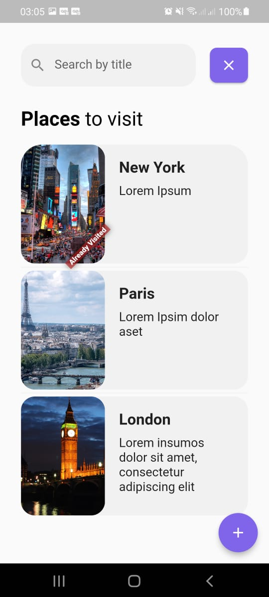
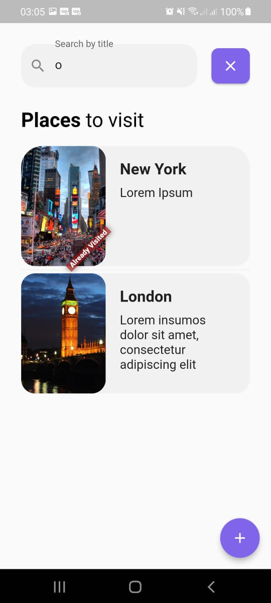
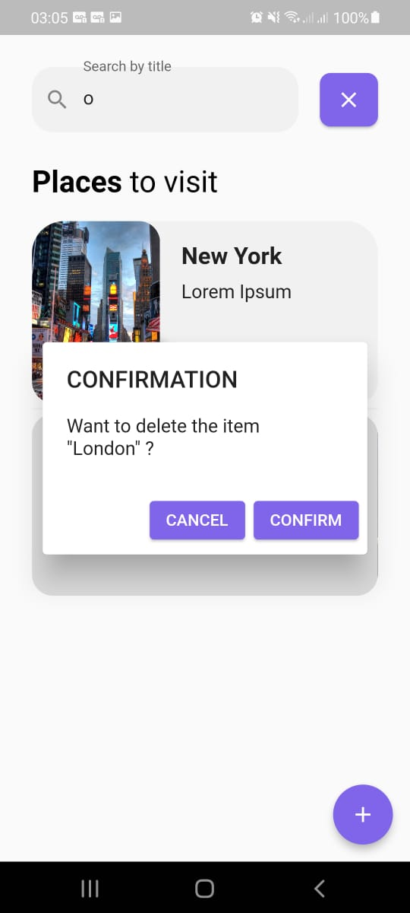
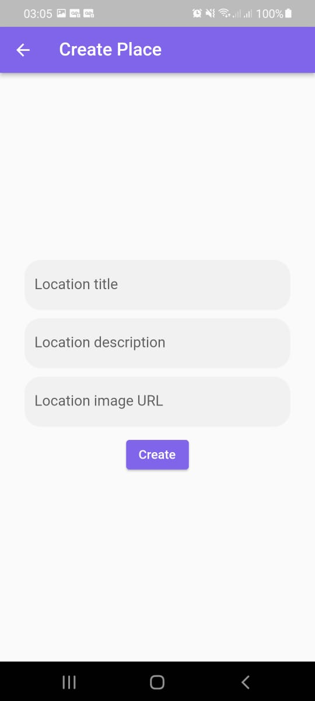
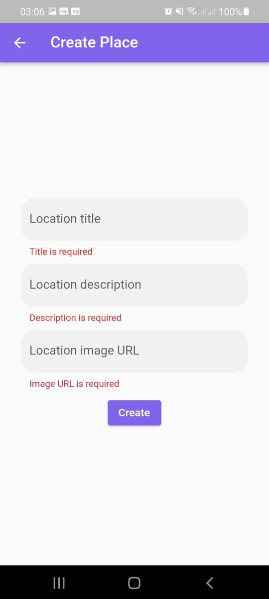

<h2 align="center">
  Arquitetura orientada a Packages
</h2>

 

<h3 align="center">
  
  
  
  
  
</h3>

---

## 📃 Sobre

Este projeto foi desenvolvido abordando as três áreas do desenvolvimento tradicional: o Backend (com NestJS, salvando os dados no MongoDB - salvo em um Cluster através do MongoDB Atlas), o Frontend (com Flutter) e o mobile (também com Flutter) com o intuito de colocar em prática os conhecimentos adquiridos até então. Os dois principais focos dessa aplicação foram o mobile (no qual foi usado o BLoC para fazer o gerenciamento de estado do mesmo, fazendo uso também do Clean Architecture; colocando, assim, em prática vários conceitos acerca deste, inclusive com o consumo de uma API criada também por mim, pois os dados foram sendo salvos no MongoDB através da aplicação backend criada) e principalmente a questão de arquitetura de software, uma vez que, neste projeto foi colocado em prática a Arquitetura orientada a packages, na qual seu foco é separar o desenvolvimento de aplicações por meio de packages, podendo, dessa forma, permitir que times diferentes atuem em projetos diferentes, que ao final se conectam em um único projeto (ou até mesmo podem ser aproveitados em outros projetos), de forma que a chance de ocorrer conflitos nos códigos versionados via Git sejam muito difíceis, uma vez que cada time estará mexendo apenas em sua frente, podendo ser essa apenas uma regra de negócio, uma funcionalidade, alguma(s) tela(s) específica(s), e afins. Trata-se de uma arquitetura excepcional para casos de trabalho com times grandes, até possibilitando também que a especialidade de cada desenvolvedor corresponda a parte em que irá trabalhar, uma vez que mesmo no desenvolvimento mobile apenas com Flutter, existem pessoas mais focadas apenas em construção de UI's e UX's, e pessoas mais focadas na parte de lógica em si, então esta arquitetura também contribui nesse aspecto em que cada desenvolvedor pode focar mais numa sub-área específica.  
Nesta aplicação em específico, toda a regra de negócio ficou dentro de um package criado chamado business_layer, de forma que seguindo o Clean Architecture, dentro deste package ficaram apenas as camadas de Domain, Infra e Data, na qual estará toda regra de negócio, entidades, casos de uso e afins. Dessa forma, tanto o projeto mobile quanto o projeto frontend consumiam esse package para poder fazer usso dessa regra de negócio, implementando neles apenas as camadas de UI e de Presenter. Assim, mesmo para duas frentes diferentes (mobile e web), foi possível que um único código que está dentro do package fosse aproveitada para ambos os projetos, de forma que suas UI's pudessem ser diferentes, mas eles teriam acesso a mesma regra de negócio. Com base nisso, é perceptível que trata-se de uma arquitetura muito boa quando o time de desenvolvimento é grande ou até quando o projeto também é muito grande. Porém, assim como qualquer arquitetura, ela também tem seus pontos negativos, tais como:  
* É mais difícil de dar manutenção, afinal, uma parte do código fonte estará em um ou até mais projetos separados; 
* Sempre que for mudado algo na parte da regra de negócio todas as frentes precisam ser testadas novamente (nesse aspecto lembra muito os microservices); 
* Tem problemas específicos de cache que ocorrem no VSCode em que é preciso direto rodar flutter clean e flutter pub get para resolver quando estamos trabalhando com esta arquitetura;
* Entre outros.
 

Mas o foco desse projeto era colocar em prática essa arquitetura que achei sensacional, e ela se saíu muito bem. Para o projeto produzido, não valia apena sua aplicação, afinal, eu o fiz sozinho e também o projeto não era grande (é um TODOLIST de locais que uma pessoa pretende viajar); mas foi bom ter colocado em prática tais conceitos, reforçando, ainda mais, também, meus conhecimentos em Flutter, arquitetura de software e Clean Architecture.

---

## Plano de desenvolvimento da aplicação

Com relação à construção do projeto, o mesmo foi feito utilizando o “VSCode”,
que é um editor de código-fonte muito utilizado no mercado de trabalho e que dá
suporte para várias linguagens e ou frameworks, tal como no caso do “Flutter” e do
“Dart”. Com relação a este projeto em específico, o mesmo foi subido para o “Github” (uma plataforma na nuvem que serve para hospedagem de códigos fonte, além de fornecer várias funcionalidades).  
A linguagem escrita utilizada no projeto foi o inglês, ou seja, cada arquivo dentro
de cada projeto está escrito em inglês na linguagem de programação “Dart”, assim como o nome das pastas; e no caso do backend, na linguagem de programação "Typescript".
A explicação sobre a estruturação do projeto, o uso do Clean Architecture e o uso do Modular no projeto são as mesmas que eu usei no projeto do Fingerprint APS, que pode ser encontrado no link: https://github.com/matheusEduardoTavares/fingerprint_aps.  
No desenvolvimento mobile, é possível criar aplicativos utilizando linguagens de programação que são específicas de cada plataforma (nativas), ou fazendo uso de frameworks híbridos, que atendem todas as plataformas. No caso deste projeto, fora utilizado o “Flutter” que é um framework híbrido. Para a utilização de alguns recursos nativos por meio deste tipo de framework, é preciso fazer uso de bibliotecas chamadas de “packages”, de forma que por debaixo dos panos tais “packages” se comunicam diretamente com o nativo, pois cada plataforma tem seu tratamento específico para seus recursos. Consequentemente, vê-se que é muito raro haver aplicativos “Flutter” que não façam uso de nenhum package, assim como neste projeto algumas bibliotecas foram usadas.  
Todas as bibliotecas que foram utilizadas no projeto e o motivo de uso das mesmas:
* asuka: Traz várias facilidades com relação ao gerenciamento do contexto da aplicação, sendo usado no projeto para mostrar modais;
* bloc: No Flutter temos os chamados gerenciamentos de estados, técnicas que facilitam a troca de informações de estado entre componentes, uma vez que a árvore de “Widgets” (componentes) pode ser muito grande e dificultar o acesso do mesmo, e também traz simplicidades para questão de atualizar esse estado. Um desses gerenciadores de estados é o “Bloc”. Existe um padrão chamado “Bloc Pattern” que também serve para gerenciar estados, mas, é diretamente através de streams nativas, e existe o “Bloc Provider” que também faz tal gerenciamento e que por baixo dos panos faz uso de “streams”, mas, não de forma direta, inclusive tendo uma alternativa fornecida chamada “Cubit” que é uma forma simplificada de tal gerenciamento e que pode ser usada em telas mais simples. Especificamente nesta aplicação, fora usado o “Bloc Provider” e o “Cubit”;
* cupertino_icons: Traz uma série de ícones para a padronização Cupertino (design voltado para iOS), que não fora utilizado, mas, que vem por padrão em todo projeto Flutter;
* flutter_bloc: É usado em conjunto com o package “bloc”, mas, este especificamente provê os “Widgets” que fazem acesso direto ao estado, para que possam realizar ações ou atualizar a tela automaticamente caso o estado da aplicação associado ao seu uso seja alterado;
* flutter_modular: Serve para facilitar a disponibilização das dependências na aplicação, fazendo o chamado gerenciamento dos “binds” e também para melhorar a estruturação das rotas da aplicação, de forma a evoluir a qualidade da arquitetura do projeto, tornando-o mais escalável, dando também a possibilidade de modularizar o projeto de forma fácil, trazendo outros recursos juntamente também. É um package usado por grandes empresas que trabalham com “Flutter” no Brasil;
* validatorless: Um package bem simples que traz vários facilitadores para fazer validações de TextFormFields (campos de texto onde o usuário digita);
* business_layer: Esse é o package que foi criado por mim que está com toda a regra de negócio, e tanto o mobile quanto o web importam este package para usufruir disso.
 

Sobre o backend, foram usadas as seguintes libs: class-validator, class-transformer e mongoose.

--- 

## ⭐ Imagens da aplicação
 

     ") ") ") ") ")

---

## 🚀 Tecnologias e recursos utilizados

Este projeto foi desenvolvido com as seguintes tecnologias:
- [**Visual Studio Code**](https://code.visualstudio.com/): um editor de código-fonte desenvolvido pela Microsoft, que é multiplataforma e muito utilizado;
- [**Dart**](https://dart.dev/): Linguagem de programação;
- [**Flutter**](https://flutter.dev/): Uma UI Toolkit que traz várias facilidades para desenvolvimento Cross-Platform;
- [**Typescript**](https://www.typescriptlang.org/): Linguagem de programação;
- [**NestJS**](https://nestjs.com/): Uma estrutura progressiva do Node.js para criar aplicativos do lado do servidor eficientes, confiáveis ​​e escaláveis;
- [**MongoDB**](https://www.mongodb.com/): É um software de banco de dados orientado a documentos livre (noSQL), de código aberto e multiplataforma;

---

## 🔧 Instalação e execução

Um dos requisitos para a construção deste projeto era ter instalado na máquina
de trabalho o “SDK” do Flutter para ser possível a compreensão de seu código, e
como facilitador tem-se a adição de um “CLI” próprio para facilitar o uso de comandos
de acesso ao “Flutter” via terminal (ou seja, foi-se adicionado na variável “PATH” do
computador o caminho onde o binário do Flutter estava para que dessa forma, via
linha de comando, fosse possível a execução de comandos “Flutter”). A versão do Flutter utilizado no projeto foi a "2.10.2". Outro requisito tanto para o web quanto para o mobile, é ter dentro de suas raízes um arquivo chamado .env, e dentro dele ter o seguinte conteúdo: base_url=http://<IP DA MÁQUINA>:<PORTA QUE DESEJA QUE SEJA ACESSADO, PRECISANDO MUDAR TAMBÉM NO BACKEND SE FOR PEGAR OUTRA PORTA QUE NÃO A 8080>, para que assim o Dio possa requisitar para o backend da máquina em que a API está rodando.   
Sobre os requisitos para o backend, é preciso ter o NestJS instalado na máquina, rodar o npm install para instalar todas as suas dependências. Então, é preciso acessar o MongoDB Atlas, entrar na conta, criar um novo Cluster para a aplicação em específico (pode ter toda configuração mínima, afinal, é uma aplicação com objetivo de estudos, e não para ser usada em produção), liberar para o IP da máquina ou colocar o IP 0.0.0.0/0 para permitir acesso externo para alguma origem (não recomendado para produção usar o 0.0.0.0/0) e adicionar um usuário. Feito tudo isso, é só tentar se conectar ao cluster, indo em Connect your application, copiando a String de conexão, atualizando tal String de conexão com o usuário e senha corretamente, de forma que após fazer isso, dentro da raíz do projeto do NestJS, é preciso criar o arquivo chamado .env, e nela colocar o conteúdo:
url_connection=<String de conexão do cluster preenchido com usuário e senha corretos>.
 
Então, basta deixar a API rodando localmente (npm run start:dev), e assim será possível consumir tanto via o APP quanto via WEB essa API.

<h5 align="center">
  &copy;2022 - <a href="https://github.com/matheusEduardoTavares">Matheus Eduardo Tavares</a>
</h5>